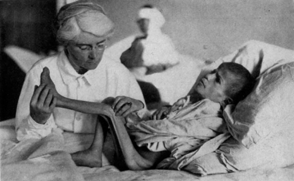

**Chapter Four: In the Field**

This chapter focuses on the creation of publicity media in the midst of
humanitarian aid operations in the Near East from 1919-1923. Up until
this point, the advocacy efforts remained largely separate from the
actual work of giving humanitarian aid. With the establishment of field
operations the publicity media transformed from posters into
photographs; stilted diplomatic dispatches turned into descriptive
personal accounts from NER personnel working with the refugees.
Together, photography and literary reportage altered the personae of
Armenians into starving, diseased orphans.

Horrific images of the Armenian orphans were made palatable by
portraying Americans as saviors whose contributions brought redemption.
This dynamic is clearly displayed in this photograph of an American
physician and one such starveling. In Figure 1, Dr. Mabel Elliott is
examining a patient suffering from malnutrition and contracted tendons
for a publicity still. The doctor's correspondence offers insight into
the pressure placed upon Elliott to contribute to publicity efforts. All
NER staff were asked repeatedly to participate in the ‘selling’ of
Armenian relief to the folks back home. Our protagonist may be the most
historically visible due to her published memoirs—*Beginning Again At
Ararat* (1924)—and the papers preserved at Drexel University's Special
Collection of Women in Medicine in Philadelphia, Pennsylvania. When
coupled with these sources, the interpretation of the photograph moves
from sheer pathos to a deeper perspective on humanitarian aid,
philanthropy, and media.

The photograph of Mabel Elliott and her patient became an iconic image
for Armenian relief efforts in the U.S. First published in the November
1922 issue of *New Near East*, this photograph went on to appear in some
of the fundamental works on American relief efforts in the Near East.
Dr. Elliott included the picture in *Beginning Again At Ararat,* perhaps
the most well-known personal account of Armenian relief. The same
photograph reappears in Esther Pohl Lovejoy's 1927 account of the
American Woman's Hospitals, *Certain Samaritans*, an important text in
the history of women in medicine and the Great War. However, the image
truly gained immortality in *The Story of Near East Relief* by NER
Chairman Rev. James L. Barton. Scholars have since appropriated the
photograph to document subjects such as the Armenian Genocide, American
International Humanitarianism, and contemporary women's literature on
Armenian orphanages.

This visual image depicts a cooperative effort between the American
Women's Hospitals and the Near East Relief as well as their shared
mission. At the same time, its creation and subsequent use betrays the
underlying inequities between the two organizations. As detailed in
earlier chapters, publicity experts were an integral part of the
Armenian relief movement due to the many philanthropic demands on the
American public. Successful fundraising required concerted efforts and
appealing material to gain public support and solicit donations. Without
a publicity department to orchestrate the annual fundraising campaigns,
such organizations as Near East Relief, the American Red Cross, and
other large-scale humanitarian agencies would have been unable to send
much-needed aid to Armenian refugees. Therefore, the proffered
photograph points to the impact of NER's professionalized publicity on
affiliated organizations without such resources.

Smaller, more specialized humanitarian relief groups struggled to find
their place in a philanthropic scene dominated by veritable publicity
factories. The American Woman's Hospitals (AWH), an organization of
female physicians that coordinated medical care for the Near East
Relief, exemplifies such agencies. This organization had a peculiar
relationship with the NER in that it was both an independent agency and
one working under the auspices of the NER. It both was and was not part
of the NER. While the organization enjoyed many opportunities as part of
NER work, the AWH received limited financial support from NER and had to
do its own fundraising. As one David among a phalanx of Goliaths, AWH
successfully raised funds to support their medical relief missions in
the Near East. While professional “publicity men” trolled the region to
find material for stylized accounts of suffering, the AWH chairwoman
gathered tidbits from correspondence with physicians and nurses in the
field. Rather than maintaining an entire department of artists, writers,
photographers, and public relations experts, the AWH employed a few
professional consultants and interested medical women. This allows for a
reconstruction of the process of making publicity in the field. Despite
these enormous differences in publicity operations, the AWH held its own
in the competitive philanthropic scene and continued their humanitarian
work long after the Near Eastern crisis ended.

| Name               | City          | State/Country |
|--------------------|---------------|---------------|
| Mabel Elliott      | Benton Harbor | Michigan      |
| Ruth Parmelee      | Harpoot       | Turkey        |
| Caroline Rosenberg | San Francisco | California    |
| Elsie Mitchell     | Berkeley      | California    |
| Clara Williams     | Berkeley      | California    | 